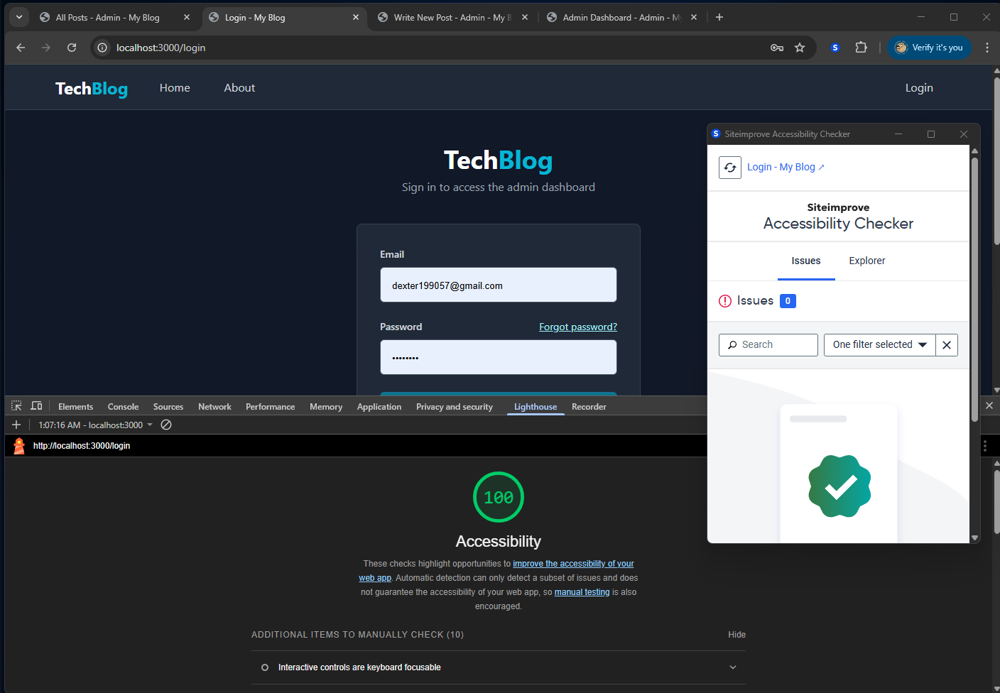

# Web 项目可访问性文档 - TechBlog

**课程名称:** Web Framework Project
**团队名称:** WebAble Crew - Group 10
**团队成员:** Hao Zhang, Dinh Khanh Chi Nguyen
**提交日期:** [请填写当前日期]

---

## 1. 引言

TechBlog 为"Web Framework Project"课程开发的技术博客平台，核心目标之一是实践并展示可访问软件的实现能力，确保所有用户（包括依赖辅助技术的用户）的友好体验。项目致力于遵循 WCAG 2.1 Level AA 标准，为用户提供平等获取信息与互动的机会。

---

## 2. 实现的可访问性功能

为确保对辅助技术用户友好，项目实施了以下关键可访问性功能：

### 2.1 语义化 HTML
采用 HTML5 语义标签 (如 `<header>`, `<nav>`, `<main>`, `<article>`, `<footer>`) 构建清晰页面结构，便于辅助技术理解。

### 2.2 ARIA 属性应用
审慎使用 ARIA 增强动态内容和自定义控件的可访问性：
*   **无障碍名称 (`aria-label`, `aria-labelledby`)**: 为无明确文本标签的控件提供可访问名称 (如 `<a aria-label="Back to all articles">...</a>`)。
*   **描述与错误提示 (`aria-describedby`)**: 关联表单输入与描述或错误信息 (如 `<input aria-describedby="title-error">` 与对应错误)。
*   **动态组件状态 (`aria-expanded`, `aria-controls`)**: 指示可折叠组件状态并关联触发器 (如 `<button aria-controls="mobile-menu" aria-expanded="false">`)。

### 2.3 键盘导航
确保所有功能键盘可访问：关键实践包括逻辑焦点顺序、可见焦点指示器 (例如通过 `focus:ring` 类实现) 及页面顶部的 "Skip to main content" 链接。

### 2.4 表单可访问性
表单设计注重可访问性：所有输入均有明确的 `<label for>` 关联，通过 `aria-describedby` 提供清晰的错误反馈，并确保交互控件有足够大的点击目标。

### 2.5 图像与图标
所有视觉元素均提供文本替代：内容图像（如博文中图片）包含描述性 `alt` 文本；纯装饰性图标通过 `aria-hidden="true"` 对辅助技术隐藏；功能性图标（如按钮内图标）则提供屏幕阅读器专用的文本描述 (例如使用 `.sr-only` 类)。

### 2.6 颜色对比度与链接
文本与背景色的对比度严格遵守 WCAG AA 级别要求 (普通文本至少 4.5:1)；链接的设计不仅依赖颜色，同时采用 `underline` 等视觉提示以确保区分度。

---

## 3. 可访问性评估

### 3.1 评估工具
我们使用 Chrome Lighthouse 及 Siteimprove Accessibility Checker 验证 TechBlog 符合 WCAG 2.1 AA 标准。所有主要页面均达此标准，且 Lighthouse 审计得分优秀。

*TechBlog 整体 Siteimprove 评分 (94/100)，A 及 AA 级均 100/100:*

*代表性页面（登录页）评估结果良好，其他主要页面结果类似:*

评估中识别并解决了如颜色对比度等问题，确保了组件符合要求。

### 3.2 使用的屏幕阅读器
团队主要使用 **[在此处填写团队使用的屏幕阅读器名称，例如 NVDA, JAWS, VoiceOver等]** 测试了主要用户流程，包括导航、阅读、登录和表单提交。

---

## 4. 团队成员职责
Hao Zhang 和 Dinh Khanh Chi Nguyen 共同负责项目整体可访问性，协作检查、测试并优化修复问题，确保项目达到标准。

---

## 5. 结论
TechBlog 团队致力于构建符合 WCAG 2.1 AA 标准的可访问平台。通过语义化HTML、ARIA、键盘导航、表单与图像可访问性及颜色对比度等实践，并结合评估工具反馈，我们努力为所有用户（包括残障用户）提供包容、易用的体验。持续关注和改进可访问性是我们的核心开发实践。

---

## 6. (可选) 演示视频链接
演示视频: [在此处插入演示视频的链接]
(视频含屏幕阅读器音频)

--- 