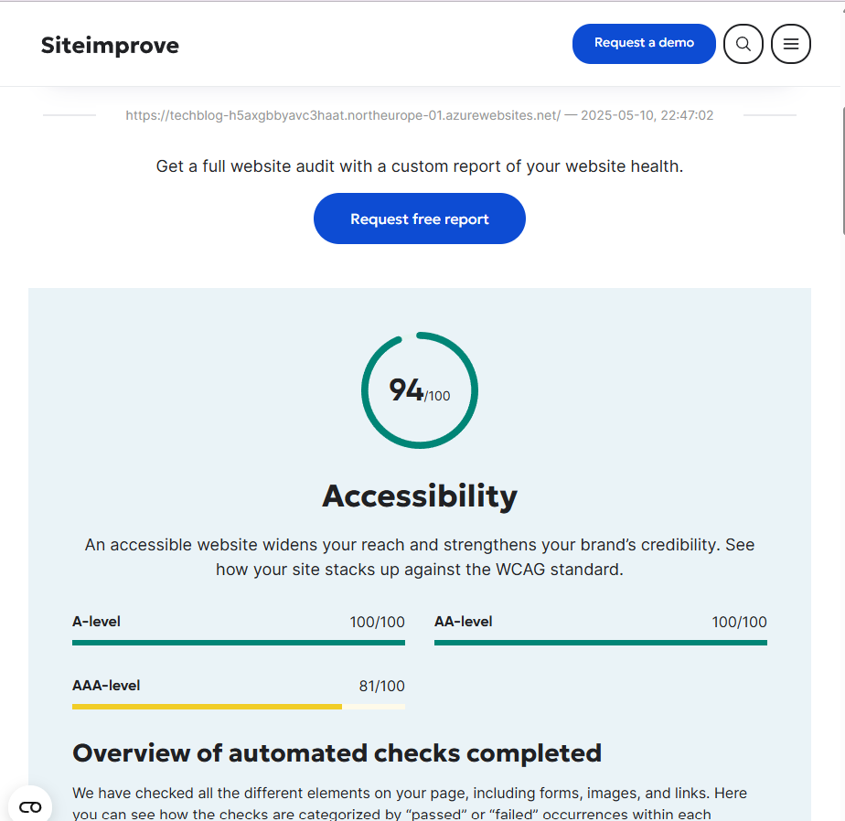
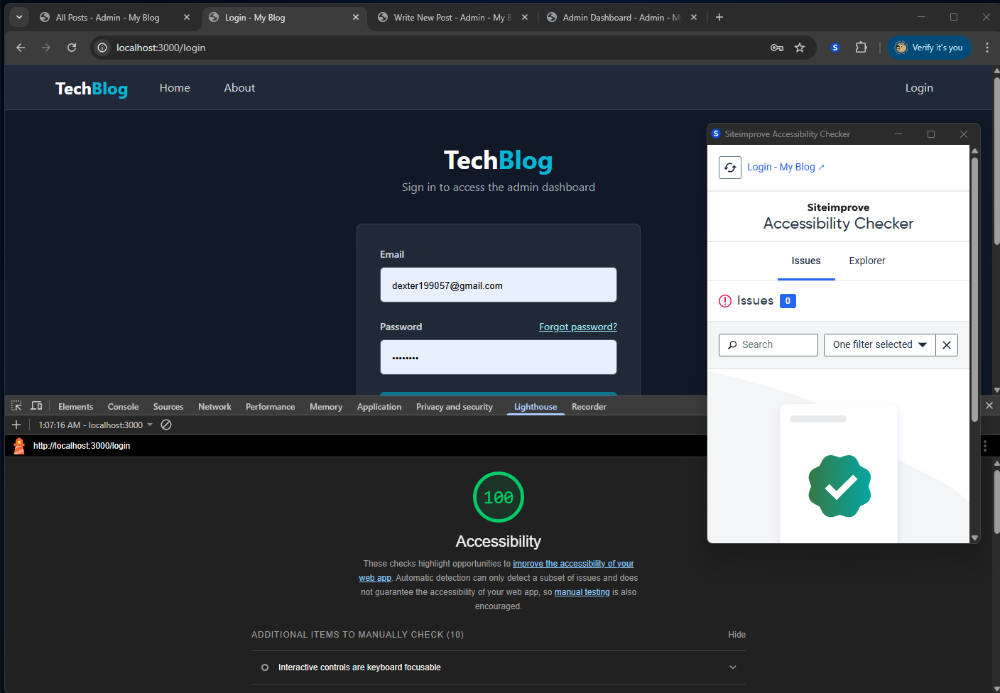

# TechBlog - Web Project Accessibility Document

**Course Name:** Web Framework Project
**Team Name:** WebAble Crew - Group 10
**Team Members:** Hao Zhang, Dinh Khanh Chi Nguyen
**Submission Date:** 2025-05-11

---

## 1. Introduction

TechBlog is a technology blog platform developed for the "Web Framework Project" course. A core objective of this project is to practice and demonstrate the ability to implement accessible software, ensuring a user-friendly experience for all users, including those who rely on assistive technologies. The project is committed to following the Web Content Accessibility Guidelines (WCAG) 2.1 Level AA standards, aiming to provide all users with equal opportunities to access information and interact.

---

## 2. Implemented Accessibility Features

To ensure user-friendliness for those relying on assistive technologies, the project implemented the following key accessibility features:

### 2.1 Semantic HTML
HTML5 semantic tags (e.g., `<header>`, `<nav>`, `<main>`, `<article>`, `<footer>`) are used to build a clear page structure, making it easier for assistive technologies to understand the content.

### 2.2 ARIA Attributes Application
ARIA attributes are judiciously used to enhance the accessibility of dynamic content and custom controls:
*   **Accessible Names (`aria-label`, `aria-labelledby`)**: Provides accessible names for controls lacking clear text labels (e.g., `<a aria-label="Back to all articles">...</a>`).
*   **Descriptions and Error Messages (`aria-describedby`)**: Associates form inputs with descriptions or error messages (e.g., `<input aria-describedby="title-error">` with its corresponding error).
*   **Dynamic Component States (`aria-expanded`, `aria-controls`)**: Indicates the current state of collapsible components and associates them with their triggers (e.g., menu button `<button aria-controls="mobile-menu" aria-expanded="false">`).

### 2.3 Keyboard Navigation
Ensured all functionalities are keyboard accessible: key practices include logical focus order, visible focus indicators (e.g., via `focus:ring` class), and a "Skip to main content" link at the top of pages.

### 2.4 Form Accessibility
Forms are designed with accessibility in mind: all inputs have clear `<label for>` associations, clear error feedback is provided via `aria-describedby`, and interactive controls have sufficiently large hit targets.

### 2.5 Images and Icons
Text alternatives are provided for all visual elements: content images (like those in blog posts) include descriptive `alt` text; purely decorative icons are hidden from assistive technologies using `aria-hidden="true"`; functional icons (like those in buttons) have screen-reader-specific text descriptions (e.g., using the `.sr-only` class).

### 2.6 Color Contrast & Links
Text and background color contrast strictly adheres to WCAG AA level requirements (at least 4.5:1 for normal text); links are designed to be distinguishable not only by color but also with visual cues like `underline`.

---

## 3. Accessibility Evaluation

### 3.1 Evaluation Tools
We used Chrome Lighthouse and Siteimprove Accessibility Checker to test and verify that TechBlog meets WCAG 2.1 AA standards. All major pages meet this standard and achieved excellent scores in Lighthouse audits.

*TechBlog overall Siteimprove score (94/100), with A and AA levels at 100/100:*

*Representative page (Login page) showing good evaluation results from Lighthouse and Siteimprove; other major pages had similar results:*

Issues identified during evaluation, such as initial color contrast deficiencies, were addressed to ensure all components meet requirements.

### 3.2 Screen Reader Used
The team primarily used NVDA to test key user flows, including navigation, reading, login, and form submission.

---

## 4. Team Member Responsibilities
Team members Hao Zhang and Dinh Khanh Chi Nguyen were jointly responsible for the overall accessibility of the project. They collaborated to continuously check, test, optimize, and fix issues, ensuring the project met the established accessibility standards.

---

## 5. Conclusion
The TechBlog team is committed to building an accessible platform compliant with WCAG 2.1 AA standards. Through practices such as semantic HTML, ARIA, keyboard navigation, accessible forms and images, color contrast considerations, and feedback from evaluation tools, we strive to provide an inclusive and easy-to-use experience for all users, including those with disabilities. Continuous attention to and improvement of accessibility is a core development practice for us.

---

## 6.  Demonstration Video Link
**Video Link:** [https://www.youtube.com/watch?v=Y4vywFMJUNU](https://www.youtube.com/watch?v=Y4vywFMJUNU)

--- 